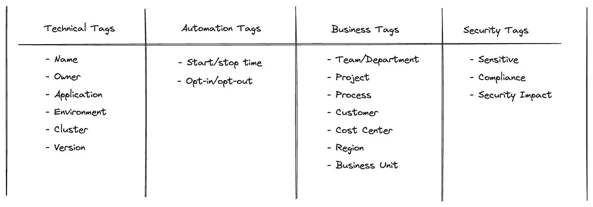

# IaC

Infrastructure as Code

## AWS



## Instructions

### Docker

```sh
docker build -t devops .
docker run --name devops -it --rm -v ./shared:/shared devops /bin/bash
```

### Gcloud Cli

```sh
gcloud auth activate-service-account SERVICE_ACCOUNT@DOMAIN.COM --key-file=/path/key.json --project=PROJECT_ID
```

Example

```sh
gcloud auth activate-service-account study-bigquery@study-gcp-398200.iam.gserviceaccount.com --key-file=/shared/secrets/study-bigquery.json --project=study-gcp-398200
```

### AWS Cli

```sh
aws configure
```

```sh
aws s3 ls | awk '{print $NF}'
```

### Terraform

Acessar a pasta ```shared``` no container

```sh
terraform init
```

```sh
terraform plan -var 'instance_type=t2.micro' -var 'ami=ami-0a0d9cf81c479446a' -out lab2-plan.txt
```

```sh
terraform apply --auto-approve
terraform apply -var-file="variaveis.tfvars"
```

```sh
terraform output
```

```sh
terraform destroy --auto-approve
terraform destroy -var-file="variaveis.tfvars"
```

```sh
terraform graph
```

## References

- https://www.xcubelabs.com/blog/gitops-explained-a-comprehensive-guide/
- https://github.com/hashicorp/hcl
- https://developer.hashicorp.com/terraform/intro/core-workflow
- https://www.baeldung.com/ops/terraform-best-practices
- https://github.com/GoogleCloudPlatform/notebooks-blueprint-security
- https://medium.com/@mlabouardy/aws-tagging-best-practices-dcc9a6dd29af
- https://spacelift.io/blog/terraform-tags
- https://spacelift.io/blog/terraform-best-practices
- https://spacelift.io/blog/importing-exisiting-infrastructure-into-terraform